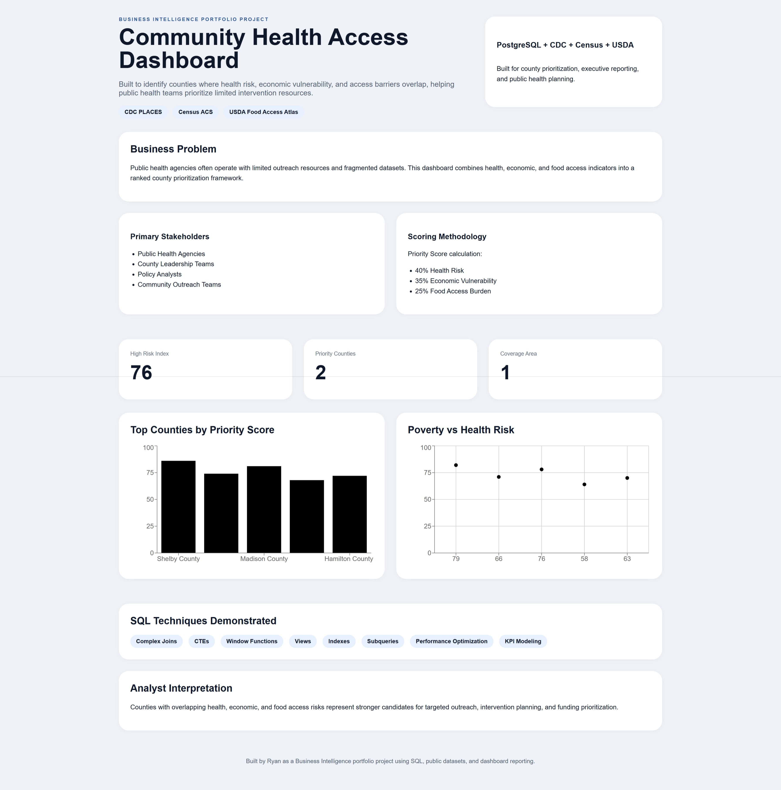
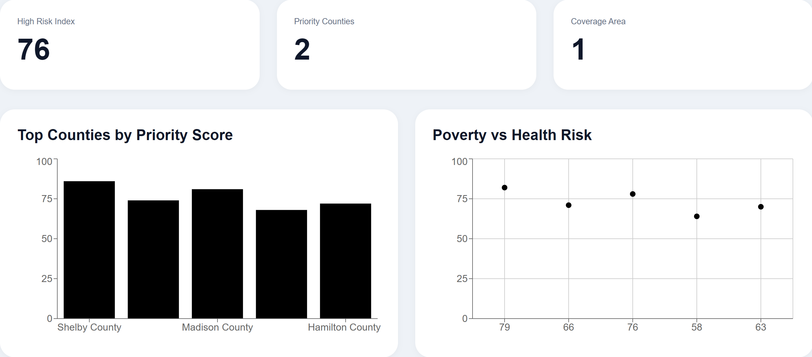

# Community Health Access BI Dashboard

A business intelligence portfolio project using public CDC, Census, and USDA data to identify counties where health risk, economic vulnerability, and limited food access overlap.

## Dashboard Preview

### Full Dashboard



### KPI and Analytics View



### SQL Techniques Section


## Business Problem

Public agencies, nonprofit health networks, and community planning teams often need to decide where limited outreach dollars should go first. The issue is not just one metric. A county may have high diabetes risk, high poverty, limited preventive care, and poor food access at the same time.

This project answers a practical BI question:

> Which counties should be prioritized for public health outreach based on combined health, economic, and food access risk?

## Target Users

|User|Decision They Need To Make|
|-|-|
|Public health program manager|Which counties need intervention first?|
|Grant analyst|Where should funding be directed?|
|Community outreach team|Which locations need screenings or education campaigns?|
|Executive stakeholder|What are the top risk areas and why?|

## Use Case

The dashboard gives stakeholders a ranked view of counties by priority score, with drilldowns into health outcomes, poverty, uninsured rates, and food access pressure. The goal is not to diagnose individuals. The goal is to support resource allocation and planning.

## Data Sources

|Source|Dataset|Purpose|
|-|-|-|
|CDC|PLACES County Data|County health outcomes, behaviors, and preventive care|
|Census Bureau|ACS 5 Year Data|Population, poverty, income, insurance, demographics|
|USDA ERS|Food Access Research Atlas|Low income and low access food indicators|

## Key Business Questions

1. Which counties have the highest combined public health risk?
2. Where do high chronic disease indicators overlap with poverty?
3. Which counties have poor preventive care access compared with peers?
4. Are some counties high risk because of health outcomes, economic pressure, food access, or all three?
5. Which counties should be prioritized for outreach campaigns?

## KPIs

|KPI|Description|
|-|-|
|Priority Score|Composite ranking metric combining health, economic, and food access risk|
|Health Risk Score|Average standardized risk across selected CDC health measures|
|Economic Risk Score|Poverty, uninsured rate, and income pressure indicators|
|Food Access Burden|Percent of population in low income, low access areas|
|Preventive Care Gap|Preventive care measures that fall below benchmark|
|State Risk Rank|County rank inside each state using window functions|

## Technical Skills Demonstrated

* PostgreSQL schema design
* Relational modeling
* Data cleaning and transformation
* Joins across multiple public datasets
* CTEs and layered SQL logic
* Window functions for county ranking
* Subqueries for benchmark comparisons
* Views and materialized views for dashboard use
* Indexing and performance optimization
* BI storytelling and KPI design
* Frontend dashboard deployment with Netlify

## Suggested Build Path

Start with 5 states to keep the first version clean: Tennessee, Texas, Florida, California, and New York. Expand nationally after the schema, queries, and dashboard are working.

## Project Structure

```txt
community-health-access-bi/
  README.md
  database/
    schema.sql
    indexes.sql
    views.sql
    stored\_procedures.sql
  etl/
    load\_cdc\_places.py
    load\_census\_acs.py
    load\_food\_access.py
    clean\_transform.py
  sql/
    beginner\_queries.sql
    intermediate\_queries.sql
    advanced\_queries.sql
    performance\_tuning.sql
  frontend/
    src/
      App.jsx
      main.jsx
      data.js
    package.json
    index.html
  docs/
    data\_dictionary.md
    project\_plan.md
    interview\_talking\_points.md
  data/
    raw/
    processed/
```

## Portfolio Summary

Community Health Access BI Dashboard is a real world analyst project that combines CDC health estimates, Census socioeconomic indicators, and USDA food access data to identify counties with the greatest need for public health outreach. The project demonstrates practical SQL, BI thinking, stakeholder focused KPI design, relational modeling, data cleaning, and dashboard development.

>>>>>>> cb37a9a545c9f6a1ac8b61664dcd4f75798acfac

